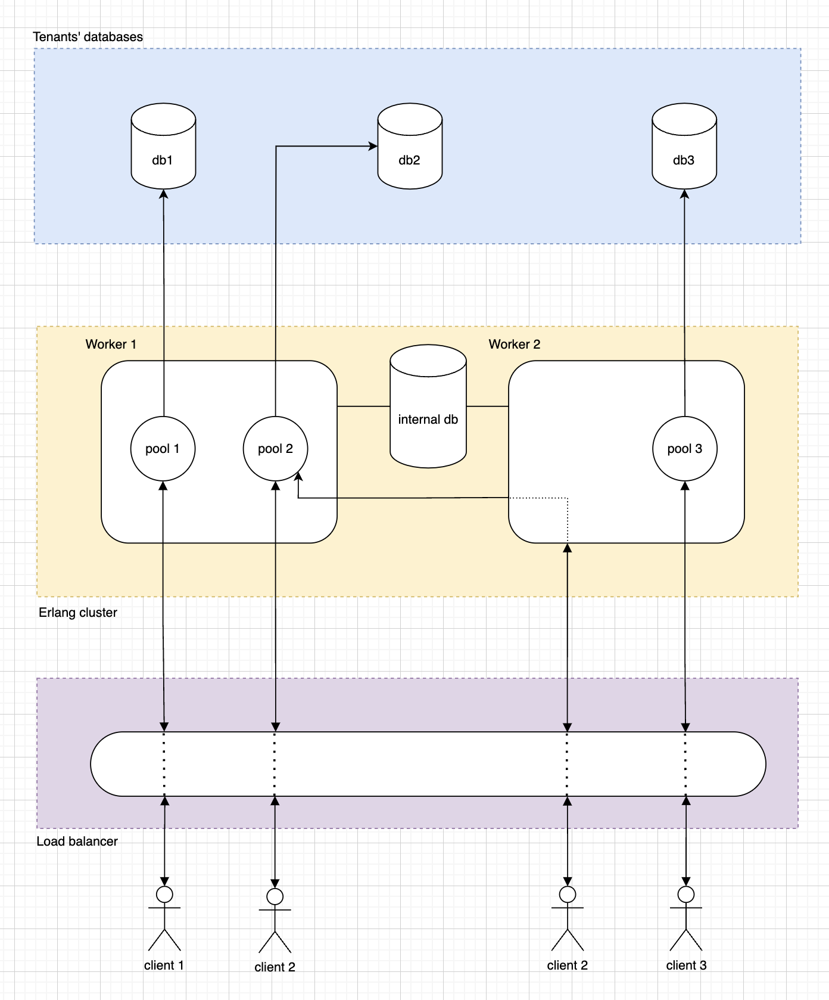
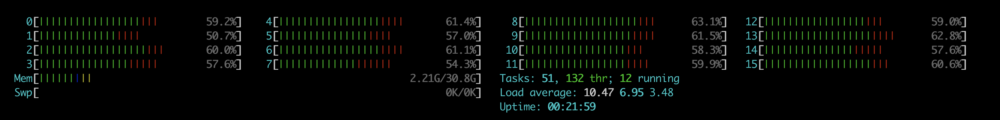

# supavisor

## Overview

Supavisor is a scalable, cloud-native Postgres connection pooler. A Supavisor cluster is capable of proxing millions of Postgres end-client connections into a stateful pool of native Postgres database connections.

For database managers, Supavisor simplifies the task of managing Postgres clusters by providing easy configuration of highly available Postgres clusters ([todo](#future-work)).

## Architecture

Supavisor was designed to work in a cloud computing environment as a highly available cluster of nodes. Tenant configuration is stored in a higly available Postgres database. Configuration is loaded from the Supavisor database when a tenant connection pool is initiated.

Connection pools are dynamic. When a tenant client connects to the Supavisor cluster the tenant pool is started and all connections to the tenant database are established. The process ID of the new tenant pool is then distributed to all nodes of the cluster and stored in an in-memory key-value store. Subsequent tenant client connections live on the inbound node but connection data is proxied from the pool node to the client connection node as needed.

Because the count of Postgres connections is constrained only one tenant connection pool shoud be alive in a Supavisor cluster. In the case of two simlutaneous client connections starting a pool, as the pool process IDs are distributed across the cluster, eventually one of those pools is gracefully shutdown.

The dynamic nature of tenant database connection pools gives enables high availability in the event of node outages. The pool processes are monitored by each node. If a node goes down that process ID is removed from the cluster. Tenant clients will then start a new pool automatically as they reconnect to the cluster.

This design enables blue-green or rolling deployments as upgrades require. A single VPC / multiple availability zone topology is possible and can provide for greater redundancy when load balancing queries across read replicas is supported ([todo](#future-work)).

## Docs

- [Installation and usage](https://github.com/supabase/supavisor/wiki/Installation-and-Usage)
- [Metrics](https://github.com/supabase/supavisor/wiki/Metrics)

## Features

- Fast
  - Within 90% throughput as compared to `PgBouncer` running `pgbench` locally
- Scalable
  - 1 million Postgres connections on a cluster
  - 250_000 idle connections on a single 16 core node with 64GB of ram
- Multi-tenant
  - Connect to multiple different Postgres instances/clusters
- Single-tenant
  - Easy drop-in replacement for `PgBouncer`
- Pool mode support per tenant
  - Transaction
- Cloud-native
  - Cluster-able
  - Resiliant during cluster resizing
  - Supports rolling and blue/green deployment strategies
  - NOT run in a serverless environment
  - NOT dependant on Kubernetes
- Observable
  - Easily understand throughput by tenant, tenant database or individual connection
  - Prometheus `/metrics` endpoint
- Manageable
  - OpenAPI spec at `/api/openapi`
  - SwaggarUI at `/swaggerui`
- Highly available
  - When deployed as a Supavisor cluster and a node dies connection pools should be quickly spun up or already available on other nodes when clients reconnect
- Connection buffering
  - Brief connection buffering for transparent database restarts or failovers

## Future Work

- Load balancing
  - Queries can be load balanced across read-replicas
  - Load balancing is independant of Postgres high-availability management (see below)
- Query caching
  - Query results are optionally cached in the pool cluster and returned before hitting the tenant database
- Session pooling
  - Like `PgBouncer`
- Multi-protocol Postgres query interface
  - Postgres binary
  - HTTPS
  - Websocket
- Postgres high-availability management
  - Primary database election on primary failure
  - Health checks
  - Push button read-replica configuration
- Config as code
  - Not noly for the supavisor cluster but tenant databases and tenant database clusters as well
  - Pulumi / terraform support

## Acknowledgements

[José Valim](https://github.com/josevalim) and the [Dashbit](https://dashbit.co/) team were incredibly helpful in informing the design decisions for Supavisor.

## Benchmarking

### Local Benchmarks

- Run pgbench for a minimum of 60 seconds
- Connection init will be less of a percentage of time

### Load Test

- AWS to AWS same region
- Single Supavisor node
  - c6gd.4xlarge
  - 16vCPU/32RAM
  - Ubuntu 22.04.2 aarch64
- 200_000+ concurrents with 10_000+ QPS
- `select * from (values (1, 'one'), (2, 'two'), (3, 'three')) as t (num,letter);`
- ~50% CPU utilization
- 2.21G RAM usage

## Inspiration

- [PgBouncer](https://www.pgbouncer.org/)
- [stolon](https://github.com/sorintlab/stolon)
- [pgcat](https://github.com/levkk/pgcat)
- [odyssey](https://github.com/yandex/odyssey)
- [crunchy-proxy](https://github.com/CrunchyData/crunchy-proxy)
- [pgpool](https://www.pgpool.net/mediawiki/index.php/Main_Page)
- [pgagroal](https://github.com/agroal/pgagroal)

## Commercial Inspiration

- [proxysql.com](https://proxysql.com/)
- [Amazon RDS Proxy](https://aws.amazon.com/rds/proxy/)
- [Google Cloud SQL Proxy](https://github.com/GoogleCloudPlatform/cloud-sql-proxy)
