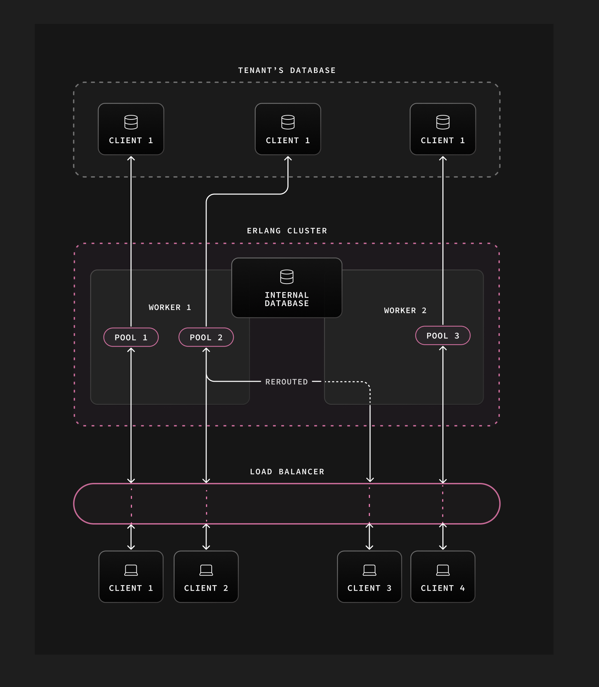

# supavisor

- [Overview](#overiew)
- [Motivation](#motivation)
- [Architecture](#architecture)
- [Docs](#docs)
- [Features](#features)
- [Future work](#future-work)
- [Acknowledgements](#acknowledgements)
- [Benchmarks](#benchmarks)
- [Inspiration](#inspiration)

## Overview

Supavisor is a scalable PostgreSQL connection pooler enabling millions of clients to efficiently utilize available database connections.

For database managers, Supavisor provides simplified configuration to manage highly available Postgres clusters ([todo](#future-work)).

## Motivation

At Supabase we host a lot of Postgres databases. Developers use Supabase for database cycles, and we want to give them as much database as possible. [PgBouncer](https://www.pgbouncer.org) doesn't take a lot of resources to run but it is another thing to run on a database instance (needs introduce that PgBouncer needs to be installed on the database instance. Also, if it doesn't take a lot resources why not use it then? Kind of defeats the purpose). Pulling connection pooling off the database instance into a cluster right next to tenant databases will free up some resources (e.g. alleviate database load) to (better) serve queries for customers.

Moreover, there is a lot of overhead in administrating Postgres databases. This management can cause downtime. To mitigate downtime as much as possible requires admins to jump through hoops. We see the connection pooler as a great entry point to give our devops team a convenient way to automate the administration of many Postgres databases and minimize downtime. (I feel like the key selling point here is that switching between Postgres databases can cause downtime but because of Supavisor it can reroute traffic to active databases thus mitigating downtime)

## Architecture

Supavisor is designed as a highly available cluster of nodes deployed in the cloud. Tenant (need to explain here what a tenant is) configuration (essenbtially database credentials) is stored in a higly available Postgres database (not a database cluster?). Configuration is loaded from the Supavisor database when a tenant connection pool is initiated.

Connection pools are dynamic (this sentence doesn't mean anything to me). When a tenant client (what's a tenant client? Providing an example can help here) connects to the Supavisor cluster the tenant pool is started and all connections to the tenant database are established. The process ID (probably need to mention this is the Elixir process id or pid) of the new tenant pool is then distributed to all nodes of the cluster and stored in an in-memory key-value store. Subsequent tenant client connections live on the inbound node (i think can just plainly say that tenant client is connecting to the nearest node or a node but doesn't gaurentee that it's the node with the pool) but connection data is proxied from the pool node to the client connection node as needed (I think the diagram below needs to appear much earlier because just reading this gets confusing).

Because the count of Postgres connections is constrained (Postgres database has an optimal number of connections to be used) only one tenant connection pool shoud be alive in a Supavisor cluster. In the case of two simlutaneous client connections starting a pool, as the pool process IDs are distributed across the cluster, eventually one of those pools is gracefully shutdown.

The dynamic nature of tenant database connection pools enables high availability in the event of node outages. Pool processes are monitored by each node. If a node goes down that process ID is removed from the cluster. Tenant clients will then start a new pool automatically as they reconnect to the cluster.

This design enables blue-green or rolling deployments as upgrades require. A single VPC / multiple availability zone topology is possible and can provide for greater redundancy when load balancing queries across read replicas is supported ([todo](#future-work)).

## Docs

- [Installation and usage](https://github.com/supabase/supavisor/wiki/Installation-and-Usage)
- [Metrics](https://github.com/supabase/supavisor/wiki/Metrics)

## Features

- Fast
  - Within 90% throughput as compared to `PgBouncer` running `pgbench` locally
- Scalable
  - 1 million Postgres connections on a cluster
  - 250_000 idle connections (should specify that these are client connections) on a single 16 core node with 64GB of ram
- Multi-tenant
  - Connect to multiple different Postgres instances/clusters
- Single-tenant
  - Easy drop-in replacement for `PgBouncer` (this would require deploying an entirely separate Elixir app though so isn't as easy. Can be something like good alternative to PgBouncer while offering high availably that PgBouncer doesn't have since it lives on database instance)
- Pool mode support per tenant
  - Transaction
- Cloud-native
  - Cluster-able
  - Resiliant during cluster resizing
  - Supports rolling and blue/green deployment strategies
  - NOT run in a serverless environment
  - NOT dependant on Kubernetes
- Observable
  - Easily understand throughput by tenant, tenant database or individual connection
  - Prometheus `/metrics` endpoint
- Manageable
  - OpenAPI spec at `/api/openapi`
  - SwaggarUI at `/swaggerui`
- Highly available
  - When deployed as a Supavisor cluster and a node dies connection pools should be quickly spun up or already available on other nodes when clients reconnect
- Connection buffering
  - Brief connection buffering for transparent database restarts or failovers

## Future Work

- Load balancing
  - Queries can be load balanced across read-replicas
  - Load balancing is independant of Postgres high-availability management (see below)
- Query caching
  - Query results are optionally cached in the pool cluster and returned before hitting the tenant database
- Session pooling
  - Like `PgBouncer`
- Multi-protocol Postgres query interface
  - Postgres binary
  - HTTPS
  - Websocket
- Postgres high-availability management
  - Primary database election on primary failure
  - Health checks
  - Push button read-replica configuration
- Config as code
  - Not only for the supavisor cluster but tenant databases and tenant database clusters as well
  - Pulumi / terraform support

## Acknowledgements

[José Valim](https://github.com/josevalim) and the [Dashbit](https://dashbit.co) team were incredibly helpful in informing the design decisions for Supavisor.

## Benchmarks

### Local Benchmarks

- Run pgbench for a minimum of 60 seconds
- Connection init will be less of a percentage of time

### Load Test

- AWS to AWS same region
- Single Supavisor node
  - c6gd.4xlarge
  - 16vCPU/32RAM
  - Ubuntu 22.04.2 aarch64
- 200_000+ concurrent client connection
- 10_000 QPS
- 35_000 QPS peak
- 50 tenant Postgres connection
- `select * from (values (1, 'one'), (2, 'two'), (3, 'three')) as t (num,letter);`
- ~50% CPU utilization
- 2.21G RAM usage

## Inspiration

- [PgBouncer](https://www.pgbouncer.org/)
- [stolon](https://github.com/sorintlab/stolon)
- [pgcat](https://github.com/levkk/pgcat)
- [odyssey](https://github.com/yandex/odyssey)
- [crunchy-proxy](https://github.com/CrunchyData/crunchy-proxy)
- [pgpool](https://www.pgpool.net/mediawiki/index.php/Main_Page)
- [pgagroal](https://github.com/agroal/pgagroal)

## Commercial Inspiration

- [proxysql.com](https://proxysql.com/)
- [Amazon RDS Proxy](https://aws.amazon.com/rds/proxy/)
- [Google Cloud SQL Proxy](https://github.com/GoogleCloudPlatform/cloud-sql-proxy)
