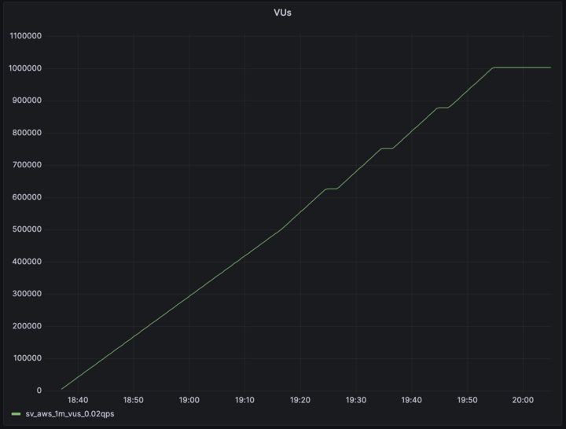
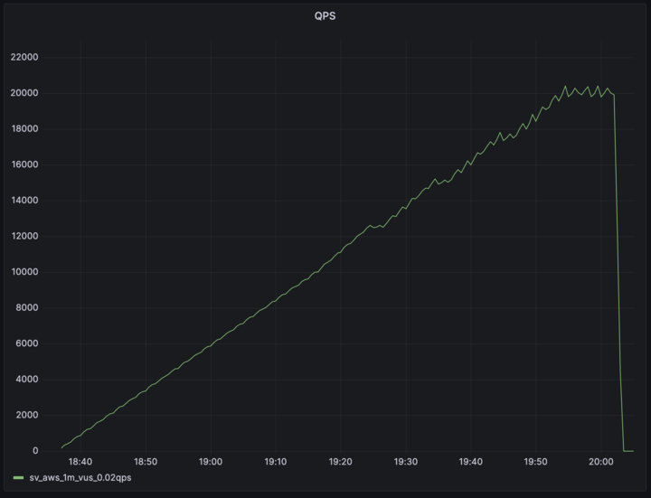

# Supavisor - Postgres connection pooler

- [Overview](#overiew)
- [Motivation](#motivation)
- [Architecture](#architecture)
- [Docs](#docs)
- [Features](#features)
- [Future work](#future-work)
- [Acknowledgements](#acknowledgements)
- [Benchmarks](#benchmarks)
- [Inspiration](#inspiration)

## Overview

Supavisor is a scalable, cloud-native Postgres connection pooler. A Supavisor cluster is capable of proxying millions of Postgres end-client connections into a stateful pool of native Postgres database connections.

For database managers, Supavisor simplifies the task of managing Postgres clusters by providing easy configuration of highly available Postgres clusters ([todo](#future-work)).

## Motivation

We have several goals with Supavisor:

- **Zero-downtime scaling**: we want to scale Postgres server compute with zero-downtime. To do this, we need an external Pooler that can buffer and re-route requests while the resizing operation is in progress.
- **Handling modern connection demands**: We need a Pooler that can absorb millions of connections. We often see developers connecting to Postgres from Serverless environments, and so we also need something that works with both TCP and HTTP protocols.
- **Efficiency**: Our customers pay for database processing power, and our goal is to maximize their database capacity. While PgBouncer is resource-efficient, it still consumes some resources on the database instance. By moving connection pooling to a dedicated cluster adjacent to tenant databases, we can free up additional resources to better serve customer queries.

## Architecture

Supavisor was designed to work in a cloud computing environment as a highly available cluster of nodes. Tenant configuration is stored in a highly available Postgres database. Configuration is loaded from the Supavisor database when a tenant connection pool is initiated.

Connection pools are dynamic. When a tenant client connects to the Supavisor cluster the tenant pool is started and all connections to the tenant database are established. The process ID of the new tenant pool is then distributed to all nodes of the cluster and stored in an in-memory key-value store. Subsequent tenant client connections live on the inbound node but connection data is proxied from the pool node to the client connection node as needed.

Because the count of Postgres connections is constrained only one tenant connection pool should be alive in a Supavisor cluster. In the case of two simultaneous client connections starting a pool, as the pool process IDs are distributed across the cluster, eventually one of those pools is gracefully shutdown.

The dynamic nature of tenant database connection pools enables high availability in the event of node outages. Pool processes are monitored by each node. If a node goes down that process ID is removed from the cluster. Tenant clients will then start a new pool automatically as they reconnect to the cluster.

This design enables blue-green or rolling deployments as upgrades require. A single VPC / multiple availability zone topologies is possible and can provide for greater redundancy when load balancing queries across read replicas are supported ([todo](#future-work)).

<p align="center">


</p>

## Docs

- [Installation and usage](https://supabase.github.io/supavisor/development/installation/)
- [Metrics](https://supabase.github.io/supavisor/monitoring/metrics/)

## Features

- Fast
  - Within 90% throughput as compared to `PgBouncer` running `pgbench` locally
- Scalable
  - 1 million Postgres connections on a cluster
  - 250_000 idle connections on a single 16 core node with 64GB of ram
- Multi-tenant
  - Connect to multiple different Postgres instances/clusters
- Single-tenant
  - Easy drop-in replacement for `PgBouncer`
- Pool mode support per tenant
  - Transaction
- Cloud-native
  - Cluster-able
  - Resilient during cluster resizing
  - Supports rolling and blue/green deployment strategies
  - NOT run in a serverless environment
  - NOT dependant on Kubernetes
- Observable
  - Easily understand throughput by tenant, tenant database or individual connection
  - Prometheus `/metrics` endpoint
- Manageable
  - OpenAPI spec at `/api/openapi`
  - SwaggerUI at `/swaggerui`
- Highly available
  - When deployed as a Supavisor cluster and a node dies connection pools should be quickly spun up or already available on other nodes when clients reconnect
- Connection buffering
  - Brief connection buffering for transparent database restarts or failovers

## Future Work

- Load balancing
  - Queries can be load balanced across read-replicas
  - Load balancing is independant of Postgres high-availability management (see below)
- Query caching
  - Query results are optionally cached in the pool cluster and returned before hitting the tenant database
- Session pooling
  - Like `PgBouncer`
- Multi-protocol Postgres query interface
  - Postgres binary
  - HTTPS
  - Websocket
- Postgres high-availability management
  - Primary database election on primary failure
  - Health checks
  - Push button read-replica configuration
- Config as code
  - Not only for the supavisor cluster but tenant databases and tenant database clusters as well
  - Pulumi / terraform support

## Benchmarks

### Local Benchmarks

- Running `pgbench` on `PgBouncer` (transaction mode/pool size 60)

```
PGPASSWORD=postgres pgbench -M extended --transactions 100 --jobs 10 --client 100 -h localhost -p 6452 -U postgres postgres
pgbench (15.2, server 14.6 (Debian 14.6-1.pgdg110+1))
starting vacuum...end.
transaction type: <builtin: TPC-B (sort of)>
scaling factor: 1
query mode: extended
number of clients: 100
number of threads: 10
maximum number of tries: 1
number of transactions per client: 100
number of transactions actually processed: 10000/10000
number of failed transactions: 0 (0.000%)
latency average = 510.310 ms
initial connection time = 31.388 ms
tps = 195.959361 (without initial connection time)
```

- Running `pgbench` on `Supavisor` (pool size 60, no logs)

```
PGPASSWORD=postgres pgbench -M extended --transactions 100 --jobs 10 --client 100 -h localhost -p 7654 -U postgres.localhost postgres
pgbench (15.2, server 14.6 (Debian 14.6-1.pgdg110+1))
starting vacuum...end.
transaction type: <builtin: TPC-B (sort of)>
scaling factor: 1
query mode: extended
number of clients: 100
number of threads: 10
maximum number of tries: 1
number of transactions per client: 100
number of transactions actually processed: 10000/10000
number of failed transactions: 0 (0.000%)
latency average = 528.463 ms
initial connection time = 178.591 ms
tps = 189.228103 (without initial connection time)
```

### Load Test





- Supavisor two node cluster
  - 64vCPU / 246RAM
  - Ubuntu 22.04.2 aarch64
- 1_003_200 concurrent client connection
- 20_000+ QPS
- 400 tenant Postgres connection
- `select * from (values (1, 'one'), (2, 'two'), (3, 'three')) as t (num,letter);`
- ~50% CPU utilization (pool owner node)
- 7.8G RAM usage

## Acknowledgements

[José Valim](https://github.com/josevalim) and the [Dashbit](https://dashbit.co/) team were incredibly helpful in informing the design decisions for Supavisor.

## Inspiration

- [PgBouncer](https://www.pgbouncer.org/)
- [stolon](https://github.com/sorintlab/stolon)
- [pgcat](https://github.com/levkk/pgcat)
- [odyssey](https://github.com/yandex/odyssey)
- [crunchy-proxy](https://github.com/CrunchyData/crunchy-proxy)
- [pgpool](https://www.pgpool.net/mediawiki/index.php/Main_Page)
- [pgagroal](https://github.com/agroal/pgagroal)

## Commercial Inspiration

- [proxysql.com](https://proxysql.com/)
- [Amazon RDS Proxy](https://aws.amazon.com/rds/proxy/)
- [Google Cloud SQL Proxy](https://github.com/GoogleCloudPlatform/cloud-sql-proxy)
